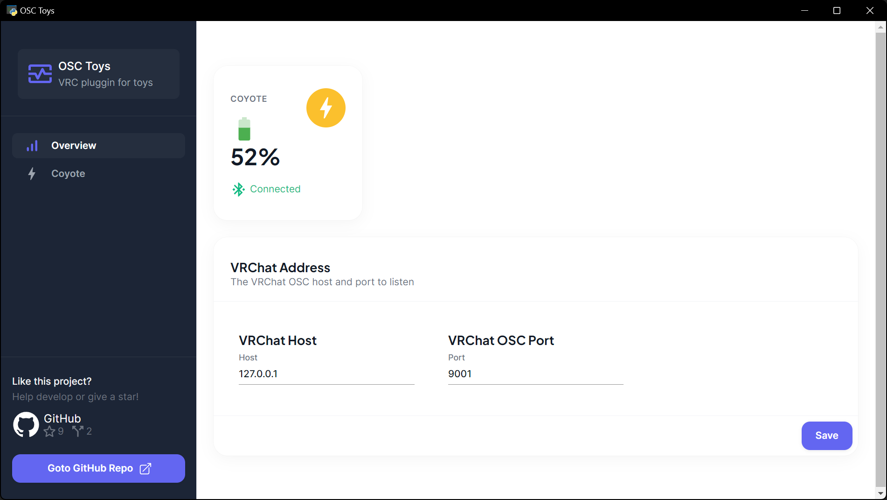
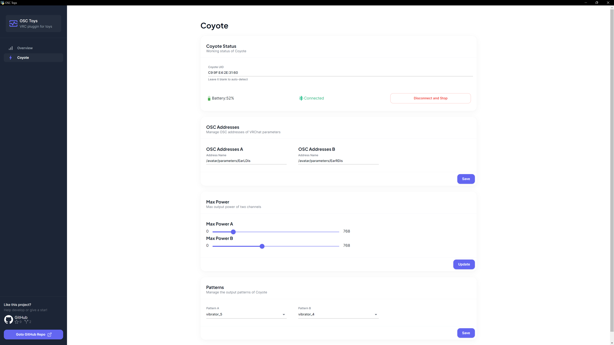

<div align="center" id="top">
  
</div>

<h1 align="center">OSC-Toys</h1>

<p align="center">
  

  

  

  

  
</p>

## 简介

该项目使用 OSC 将蓝牙玩具集成到 VRChat Avatar 中。





## 支持的玩具

- DG-Lab E-Stim（郊狼）

## 支持的游戏

- VRChat（您必须拥有一个支持 OSC 的、具有适当 Avatar 参数的模型）

## 如何工作

该程序将使用 [OSC](https://docs.vrchat.com/docs/osc-overview) 与 VRChat 通信。

它将监听 VRC 发送的某些数值，并更改玩具的力度（例如郊狼的电击强度）。

例如，使用此程序，您可以实现当某人触摸您的 Avatar 的耳朵时，您将受到电击的效果。

## 设置和安装

### 从发布版本安装

- 从 [release page](https://github.com/Sakura0721/osc-toys/releases) 下载最新的发布版本。
- 解压文件并运行 `osc-toys.exe`。
- 找到一个支持 OSC 参数的 Avatar，例如使用了 [VRCContactReceiver](https://docs.vrchat.com/docs/contacts#vrccontactreceiver) 的 Avatar。
  - 需要注意参数类型应该为 `float`。即需要使用类型为 [Proximity](https://docs.vrchat.com/docs/contacts#receiver) 的 reveiver.
  - 如果您不知道这是什么，请找一个模型师/Avatar 创作者来帮助您。
- 启动 VRC，在程序的界面中填入必要的信息，点击 `Connect and Start` 按钮。然后与您的搭档一起享受吧！

- 克隆此仓库并安装依赖项。

### 从源代码安装

如果有需要，您也可以从源代码运行程序。

```bash
git clone https://github.com/Sakura0721/osc-toys.git
cd osc-toys
pip install -r requirements.txt
```

- 编译前端：

```bash
cd frontend
npm install
npm run build
npm run export
```

- 运行程序：

```bash
python main.py
```

### 设置

并不推荐用户更改 WebUI 中没有提供的设置，WebUI 提供的设置项应该是足够的。

如果您执意修改某些设置，以下是一些可以在 `settings.yaml`中修改的配置：

- `coyote_uid` ：如果您不知道它是什么，请设置 `COYOTE_UID = None` ，程序将自动尝试检测您的设备。
- `coyote_safe_mode` ：启用或禁用安全模式。这会限制设备的最大电刺激输出。警告：如果你不知道你在做什么，将这个值设置为 True。
- `coyote_max_power_a` 和 `coyote_max_power_b` ：当来自 VSC 的值等于 1.0 时，郊狼的输出强度。
- `coyote_pattern_a` 和 `coyote_pattern_b` ：`Coyote` 的输出模式。 请参见`data\estim\pattern_dict.json`。
- `coyote_addr_a` 和 `coyote_addr_b` ：绑定到通道 A/B 的 OSC 地址。
- `VRC_HOST` 和 `VRC_OSC_PORT` ：VRC 的 OSC IP 地址和端口。如果您不知道它是什么，请将其保留为默认值。

## 更改波形

TODO：更好的文档。
郊狼波形当前存储在 `data/vibrators/pattern_dict.json` 下，子波形在 `data/estim/patterns/` 文件夹下。

## FAQ

- 程序无法连接到郊狼。/程序有时会与郊狼断开连接。
  - 如果程序无法连接到郊狼，请尝试重新运行它或在计算机重新启动蓝牙后重新运行它。请注意，您应该在郊狼的灯光不是“白色”时运行程序。如果灯光是“白色”，则表示设备处于配对模式，程序无法连接到它。
  - 连接质量问题由许多原因引起，例如设备距离计算机太远，或者周围有太多蓝牙设备。请尝试将设备移近计算机，或将计算机移至蓝牙设备较少的地方。
- 输出气昂都变化不平滑或有延迟。
  - 经测试，当`WINDOW_SIZE = 0.1`时，程序可以正常工作，即程序将每 0.1 秒更新一次玩具的强度。此时的体感延迟在 150 毫秒到 200 毫秒之间。如果您想使更新更平滑，则可以尝试减小`WINDOW_SIZE`的值。但是当值太小时，郊狼设备可能无法处理它（强度更新请求太频繁），更改将被延迟。因此，您应该找到一个平衡点。


## 联系方式

[OSC-Toys Discord 服务器](https://discord.gg/5HRgXNzCBP)


## Todos

- [ ] 将 OSC 服务端和蓝牙通信解耦
  - 目前在代码中，OSC 服务端和蓝牙通信同时启动，同时停止。这样的设计会导致增加更多的玩具变得困难。因此，需要将这两部分解耦。
- [ ] 增加更多玩具
  - 如果你有需求，欢迎开 issue 或 PR
- [x] 支持 GUI
  - 已增加 WebUI
- [ ] 考虑更换实现的语言
  - 目前遇到的一些问题（连接，以及更新延迟）可能与 python 的蓝牙库以及 async 实现有关。不确定更换成其它的实现是否会有所改善，可能需要进行一些尝试。
